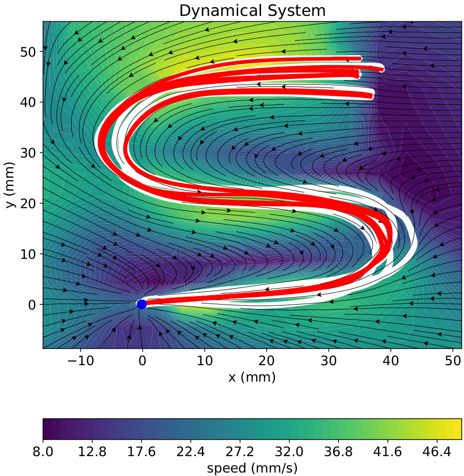
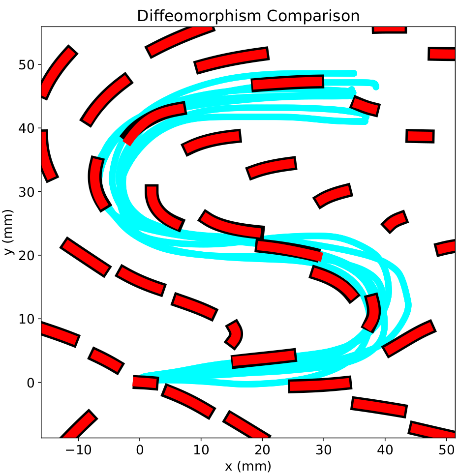
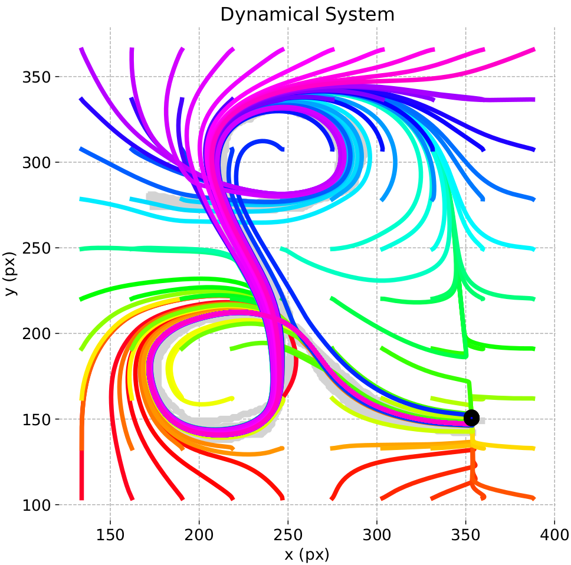
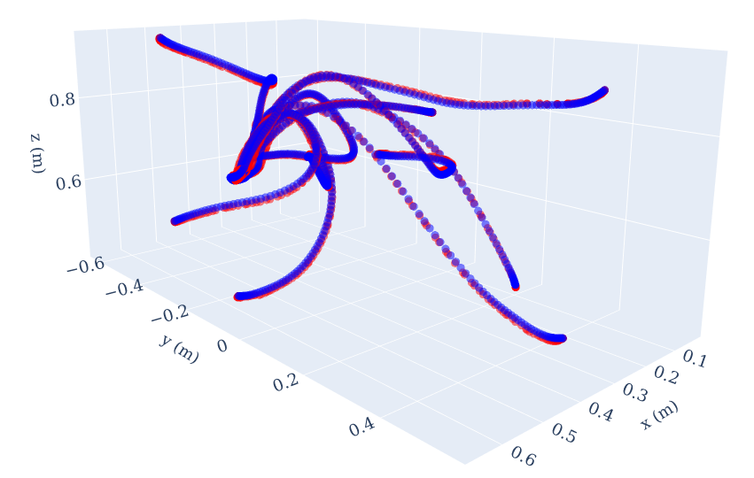
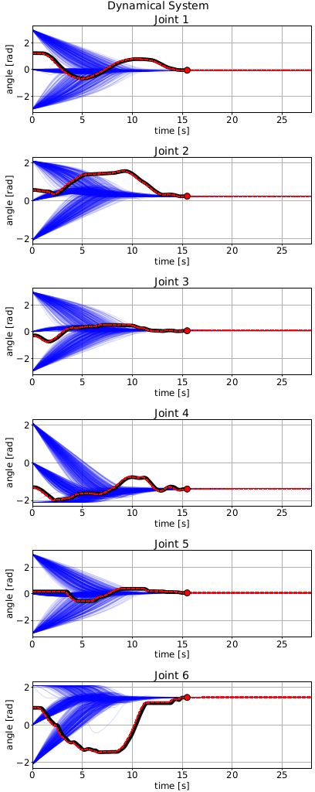

# Stable Motion Primitives via Imitation and Contrastive Learning
[](https://opensource.org/licenses/MIT)

Code accompanying the paper: "Stable Motion Primitives via Imitation and Contrastive Learning" (under review, submitted to T-RO).
For details, please refer to https://arxiv.org/pdf/2302.10017.pdf. 

The current version of the paper can be cited using the following reference:
```bibtex
@article{perez2023stable,
  title   = {Stable Motion Primitives via Imitation and Contrastive Learning},
  author  = {P{\'e}rez-Dattari, Rodrigo and Kober, Jens},
  journal = {arXiv preprint arXiv:2302.10017},
  year    = {2023}
}
```
## Teaser: executing learned motion for multiple initial conditions
<p align="center">
    
</p>

## Options
This repository allows learning dynamical systems of multiple dimensions and orders.

### First-order 2-dimensional dynamical systems
<p float="left">
  
   
</p>

### Second-order 2-dimensional dynamical systems


### First-order 3-dimensional dynamical systems


### 1-order N-dimensional dynamical systems


## Robot Experiments
This repository contains simulated experiments; however, this framework has also been tested using a KUKA LBR iiwa robot manipulator. These results are shown in https://youtu.be/OM-2edHBRfc.
<p align="center">
    
</p>

## Installation with poetry

You can install the package using poetry.
```bash
poetry install
```

Enter the virtual environment using:
```bash
poetry shell
```

Requirements can be found at `pyproject.toml`.
`
## Usage
In the folder `src` run:

### Training
```bash
  python train.py --params <params_file_name>
```
The parameter files required for the argument `params_file_name` can be found in the folder `params`.

### Simulate learned 2D motion
```bash
  python simulate_ds.py
```

### Hyperparameter Optimization
```bash
  python run_optuna.py --params <params_file_name>
```

## Troubleshooting

If you run into problems of any kind, don't hesitate to [open an issue](https://github.com/rperezdattari/Stable-Motion-Primitives-via-Imitation-and-Contrastive-Learning/issues) on this repository.
